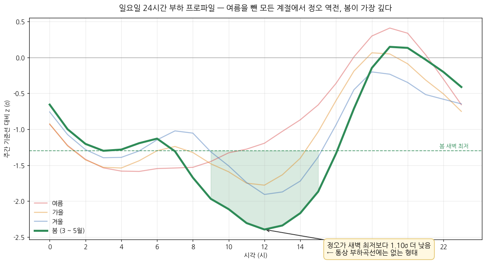
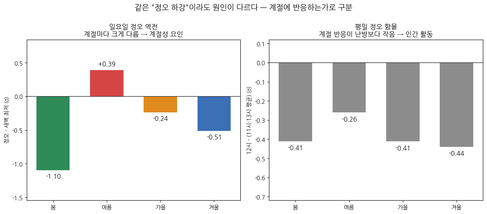
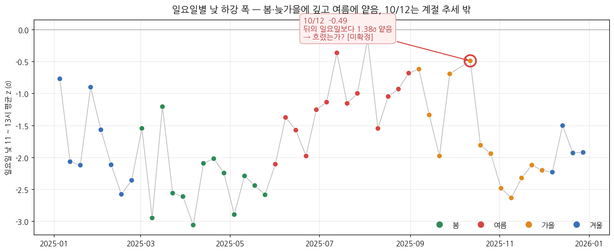

# 전력 수요 이상 탐지 — 걸러낼 것과 조치할 것의 구분

전국 시간별 전력수요 데이터에서 통계적 이상을 탐지하고, 탐지된 구간이 **설비 이상인지 계통의 정상 현상인지** 판별한 분석입니다.

이상 탐지의 실무 가치는 탐지 자체가 아니라, **걸러낼 것(계통 현상)과 조치할 것(설비 이상)을 구분하는 판단**에 있다고 보고 그 판별 과정에 분석의 무게를 두었습니다.

---

## 데이터

**주 데이터 — 전력수요**

| 항목 | 내용 |
|---|---|
| 출처 | 한국전력거래소 · 시간별 전국 전력수요량([공공데이터포털](https://www.data.go.kr/data/15065266/fileData.do)) |
| 기간 | 2025년 전체(8,760행, 결측 0건) |
| 단위 | MW |
| 인코딩 | cp949 |

원본은 `날짜 × 24시간` 가로형이므로 `melt`로 세로형(`시각`, `사용량`)으로 변환해 사용했습니다.

**기초 통계** — 평균 64,503MW / 최소 35,811MW / 최대 95,951MW / 부하율 67.2%(평균을 최대로 나눈 백분율)

최대부하가 8월 25일 월요일 17시입니다. 즉 여름 평일 오후입니다. 또한 최소부하가 5월 4일 일요일 11시입니다. 즉 봄 일요일 낮입니다. 이 두 극값의 시점이 계통 상식과 맞으므로 변환·단위 처리에 오류가 없다고 판단했습니다.

**대조 자료 — 기상**

| 항목 | 내용 |
|---|---|
| 출처 | 기상청 · ASOS 일별 자료([기상자료개방포털](https://data.kma.go.kr)) |
| 기간 | 2025년 전체(35,385행, 97지점) |
| 사용 요소 | 일조시간 |
| 단위 | hr |
| 인코딩 | cp949 |

대조 자료는 결과 ③에서 씁니다. 가설이 만들어낸 예측을 판정하려고 붙인 것이라 주 데이터와 쓰임이 다릅니다.

---

## 방법

168시간(1주일) **중심 이동평균**을 기준선으로 삼고, 편차가 임계값 K·σ를 넘는 시점을 이상으로 판정했습니다. 편차는 168시간 이동평균 기준선에서 벗어난 양을 의미하며, 탐지에 쓰입니다. z는 편차를 그 시기의 표준편차로 나눈 값입니다. MW 그대로는 시기마다 변동 폭이 달라 계절 간 비교가 안 됩니다. 그렇기에 z를 계절 간 비교에 사용합니다.

- `center=True` — 후행 평균을 쓰면 기준선이 실제 변화를 늦게 따라가면서, 이상이 아닌 구간이 이상으로 잡힙니다.
- `window=168` — 전력 수요는 24시간 주기와 요일 주기를 함께 가지므로, 요일 효과까지 기준선에 흡수시키려면 최소 1주일이 필요합니다.
- `min_periods=84` — 168시간 안에 값이 최소 몇 개 있어야 계산할지를 정합니다. 84를 고른 이유는 168의 절반이기 때문입니다. 절반 이상이 채워졌을 때만 기준선을 만들겠다는 뜻입니다. 그 결과 첫 시점 84개 · 마지막 시점 85개로 양 끝에서도 조건을 채웠고, 결측은 0건이었습니다.

### 임계값 실험

| 임계값 | 탐지 건수 | 하강 | 상승 | 전체 대비 | 정규분포 건수 | 실측 ÷ 정규분포 |
|---|---|---|---|---|---|---|
| 2.0σ | 169 | 140 | 29 | 1.93% | 399 | 0.42 |
| 2.3σ | 64 | 57 | 7 | 0.73% | 188 | 0.34 |
| 2.5σ | 34 | 33 | 1 | 0.39% | 109 | 0.31 |
| 2.7σ | 14 | 14 | 0 | 0.16% | 61 | 0.23 |
| 2.9σ | 8 | 8 | 0 | 0.09% | 33 | 0.24 |
| 3.0σ | 4 | 4 | 0 | 0.05% | 24 | 0.17 |
| 3.5σ | 0 | 0 | 0 | 0.00% | 4 | 0.00 |

일곱 임계값 전부에서 실측이 정규분포 건수보다 적고, 임계값이 올라갈수록 비율이 더 떨어집니다(0.42 → 0.00). 2.9σ에서 비율이 한 번 올라갑니다. 하지만 2.9σ 실측은 8건뿐이라 한 건이 늘거나 줄면 비율이 0.03 움직입니다. 실제로 올라간 폭은 0.013이며, 올라간 폭이 한 건의 영향인 0.03보다 작아서 추세를 뒤집지 못합니다. 그러므로 σ를 확률로 읽으면 안 됩니다.

2.0σ를 채택하지 않은 이유는 연간 169건, 주 3.2건을 사람이 검토해야 하기 때문입니다. 표의 399는 "이 데이터가 정규분포와 얼마나 다른가"를 보는 숫자이고, 169는 "사람이 실제로 열어봐야 하는 개수"이기에 서로 다른 의미를 갖습니다. 3.0σ를 채택하지 않은 이유는 4건으로 규칙성을 확인할 표본이 안 되기 때문입니다. 그래서 연간 검토 부담이 감당 가능한 수준이고, 규칙성을 확인할 표본이 되는 2.5σ를 채택했습니다. 2.5σ 탐지 34건(하강 33 · 상승 1)을 구간으로 묶으면 11개(하강 10 + 상승 1)이고, 3시간 이상 지속된 것이 하강 10구간 중 7개입니다. 상승을 포함하더라도 마찬가지로 7개입니다. 뒤쪽 임계값 견고성 표의 2.5σ 행은 하강만 세어 10구간입니다. 탐지 조건은 `abs(z)`로 잡았으므로 하강뿐 아니라 상승도 걸릴 수 있습니다. 그래서 방향을 나눠 세었습니다. 임계값이 올라가면 2.0σ의 경우 상승이 29, 2.3σ의 경우 7, 2.5σ의 경우 1, 2.7σ부터는 0입니다.

---

## 결과

### ① 무슨 일이 일어나는가 — 일요일 24시간 프로파일



2.5σ 하강 10구간이 전부 일요일이고, 구간이 시작되는 시각이 오전 9시 ~ 정오입니다.

| 시작 | 요일 | 지속 | 평균 편차 | 최대 z |
|---|---|---|---|---|
| 2025-04-06 10시 | 일 | 6h | −17,288MW | −3.11 |
| 2025-03-09 11시 | 일 | 4h | −19,783MW | −3.02 |
| 2025-05-04 09시 | 일 | 6h | −15,520MW | −2.95 |
| 2025-11-09 11시 | 일 | 3h | −16,999MW | −2.72 |
| 2025-02-16 12시 | 일 | 2h | −18,680MW | −2.69 |
| 2025-03-30 10시 | 일 | 4h | −16,102MW | −2.66 |
| 2025-05-25 10시 | 일 | 3h | −18,882MW | −2.63 |
| 2025-03-23 11시 | 일 | 3h | −17,322MW | −2.59 |
| 2025-11-02 12시 | 일 | 1h | −17,669MW | −2.59 |
| 2025-05-18 12시 | 일 | 1h | −21,020MW | −2.53 |

지속시간이 1시간인 구간이 2개, 2시간인 구간이 1개, 3시간인 구간이 3개, 4시간인 구간이 2개, 6시간인 구간이 2개입니다. 최대 지속시간이 6시간입니다.

하강 33건은 일요일 9 ~ 15시에만 존재하며 유일한 상승은 화요일 오전입니다(2025-03-04 10시 · +2.62σ · 85,127MW). 따라서 요일·시각의 쏠림은 하강에서만 나타납니다.

설비 고장이 무작위로 발생한다면 요일과 시각이 이렇게 한 곳에 모일 수 없습니다. 이 시점에서 탐지 대상이 "고장"이 아니라 "현상"이라고 판단을 바꿨습니다.

특이한 것은 하강의 형태입니다. **봄 일요일은 정오 수요가 새벽 최저보다 낮습니다** — 계절 평균 곡선 기준 43,068MW(12시) 대 50,100MW(3시)로 7,031MW 낮습니다. 일별 기준 봄 일요일 13일 중 11일에서 역전이 나타납니다. 하루 중 활동이 가장 많은 시간대가 가장 조용한 시간대보다 수요가 적은 상태로, 통상적인 일 부하 곡선에는 없는 형태입니다.

이 역전은 봄에만 있는 것이 아니라 **여름을 제외한 모든 계절에서 나타나며, 봄이 가장 깊습니다**(σ 기준 봄 −1.10 / 가을 −0.24 / 겨울 −0.51 / 여름 +0.39). 계절마다 크기가 크게 다르다는 점이 다음 단계의 출발점이 됩니다.

### ② 원인이 무엇인가 — 판별 2패널



원인 후보를 좁히기 위한 판별 기준을 다음과 같이 세웠습니다.

> **계절 반응이 자연 요인과 견줄 만하면 자연 요인, 그보다 작으면 인간 활동**

이 기준에 더해 각 후보가 사실이라면 나타났어야 할 것을 데이터와 대조해보았습니다. 그렇게 후보 셋을 배제했습니다.

**배제 ① 점심시간 효과** (우측 패널)
우측 패널 막대는 평일 정오 함몰을 앞뒤 시각 대비 σ 기준으로 그린 것입니다. 봄의 경우 −0.41σ, 여름의 경우 −0.26σ, 가을의 경우 −0.41σ, 겨울의 경우 −0.44σ입니다. 겨울이 여름의 1.69배입니다.

평일 정오는 앞뒤 시각 대비 MW 기준 봄의 경우 −2,699MW, 여름의 경우 −2,406MW, 가을의 경우 −3,022MW, 겨울의 경우 −3,417MW입니다. 겨울이 여름의 1.42배입니다.

분모(표준편차)가 계절마다 다르고 여름이 가장 큽니다(봄의 경우 6,688MW, 여름의 경우 9,502MW, 가을의 경우 7,561MW, 겨울의 경우 7,875MW로 여름이 겨울의 약 1.21배). 그렇기 때문에 같은 MW 함몰이 여름에 더 작은 σ로 나옵니다. 그래서 배수는 MW 축으로 냈습니다. 분모는 168시간 중심 이동 표준편차, 평일 11 ~ 13시의 계절 평균입니다.

평일 정오 함몰과 일요일 정오 함몰을 계절별로 비교해보면, 봄의 경우 각각 −2,699MW와 −485MW, 여름의 경우 각각 −2,406MW와 −377MW, 가을의 경우 각각 −3,022MW와 −619MW, 겨울의 경우 각각 −3,417MW와 −794MW입니다. 이 값들을 비교해보면 평일이 일요일의 각각 5.56배, 6.37배, 4.88배, 4.30배입니다. 태양광의 영향은 요일을 구분하지 않는데 정오 함몰은 요일에 따라 갈립니다.

평일 오전 8시는 앞뒤 시각 대비 MW 기준 봄의 경우 1,317MW, 여름의 경우 1,192MW, 가을의 경우 1,780MW, 겨울의 경우 3,348MW로 겨울이 여름의 2.81배입니다. 평일 정오의 계절 반응 폭이 난방의 계절 반응보다 작습니다.

요일에 따라 갈린다는 점, 계절 반응의 폭이 난방보다 작다는 점을 근거로 정오 함몰을 점심시간에 따른 인간 활동으로 판단했습니다. 그래서 분석에서 배제했습니다.

**배제 ② 겨울 난방 프로파일**
평일 겨울 8시가 +1.52σ입니다(봄 +0.79 / 여름 +0.37 / 가을 +0.79). 난방의 계절 반응(평일 오전 8시) 크기는 앞뒤 시각 대비 봄의 경우 1,317MW, 여름의 경우 1,192MW, 가을의 경우 1,780MW, 겨울의 경우 3,348MW로 겨울이 여름의 2.81배입니다. 난방이 아침에 몰렸다가 낮에 완만해지는 형태로 겨울 정오 역전(−3,879MW)이 설명될 수 있습니다. 그러므로 겨울은 태양광 귀속에서 제외합니다.

**배제 ③ 조업 중단·설비 정지**
일요일 밤(20 ~ 22시) z는 −0.54 ~ +0.11σ이고, 낮(11 ~ 13시)은 −0.87 ~ −2.55σ입니다. 하루 전체가 균일하게 낮아지는 것이 아닙니다. 낮이 밤보다 깊습니다. 조업 중단이나 설비 정지라면 밤에도 나타나야 합니다.

| 월 | 낮 11 ~ 13시 | 밤 20 ~ 22시 | 낮 − 밤 |
|---|---|---|---|
| 1 | −1.47 | −0.46 | −1.01 |
| 2 | −2.16 | −0.45 | −1.71 |
| 3 | −2.18 | −0.14 | −2.03 |
| 4 | −2.35 | +0.09 | −2.44 |
| 5 | −2.55 | −0.02 | −2.53 |
| 6 | −1.66 | +0.11 | −1.77 |
| 7 | −0.92 | +0.04 | −0.96 |
| 8 | −0.87 | −0.08 | −0.80 |
| 9 | −1.16 | −0.31 | −0.85 |
| 10 | −1.42 | −0.20 | −1.22 |
| 11 | −2.35 | −0.36 | −1.99 |
| 12 | −1.90 | −0.54 | −1.35 |

낮의 경우 12개월 전부 음수로 나타났습니다. 밤의 경우 9개월은 음수로, 3개월(4·6·7월)은 양수로 나타났습니다. 가장 깊은 밤의 경우 −0.54σ로 가장 얕은 낮의 −0.87σ보다 얕습니다.

**남는 것은 봄입니다.** 난방이 가장 약한 계절 중 하나인 봄(평일 8시 +0.79σ)에서 정오 역전이 가장 깊게(−1.10σ) 나타납니다. 점심시간·난방·조업 중단을 배제한 뒤 남는 잔여분을 **태양광 자가발전에 의한 계통 순수요 잠식으로 추정**했습니다.

> **근거는 배제법입니다.** 기상 자료와는 대조했으나 발전실적과는 대조하지 못했습니다.

여름에 부호가 뒤집히는(+0.39) 것은 냉방 부하 증가가 같은 시간대에 겹치기 때문으로 보이나, 두 성분을 분리해 계산하지 않았습니다. 여름은 냉방과 태양광이 같은 시간대에 겹쳐 분리할 수 없으므로 반증 근거로도 지지 근거로도 쓰지 않고 배제법 판별 대상에서 제외했습니다. 따라서 배제법 판별은 봄·가을·겨울 셋으로 했습니다.

**밤 범위 견고성 확인** — 밤 범위를 19 ~ 21시로 바꿔도 **가장 깊은 상위 6개월의 순위는 완전히 일치**합니다. 다만 하위 6개월 중 2개월(1·7월)은 최대 1계단 뒤바뀌고, σ 대신 MW 원단위로 보면 12개월 중 8개월의 순위가 달라집니다(3월 σ일 때 3위→MW일 때 5위, 6월 σ일 때 5위→MW일 때 4위, 11월 σ일 때 4위→MW일 때 3위). z의 분모인 표준편차가 여름에 커서 같은 MW 하강이 작은 σ로 나오기 때문입니다.

> **방향(부호)은 12개월 전부 일치하므로 결론은 유지됩니다.** 다만 "설정을 바꿔도 순위가 그대로다"라고 쓰면 틀립니다. 마찬가지로 "여름에는 현상이 거의 없다"도 MW 기준에서는 성립하지 않습니다.

| 월 | σ값 | σ순위 | MW값 | MW순위 |
|---|---|---|---|---|
| 1 | −1.01 | 9 | −7,808 | 11 |
| 2 | −1.71 | 6 | −13,516 | 6 |
| 3 | −2.03 | 3 | −13,681 | 5 |
| 4 | −2.44 | 2 | −14,824 | 2 |
| 5 | −2.53 | 1 | −16,947 | 1 |
| 6 | −1.77 | 5 | −14,161 | 4 |
| 7 | −0.96 | 10 | −9,867 | 8 |
| 8 | −0.80 | 12 | −8,282 | 9 |
| 9 | −0.85 | 11 | −7,220 | 12 |
| 10 | −1.22 | 8 | −7,832 | 10 |
| 11 | −1.99 | 4 | −14,593 | 3 |
| 12 | −1.35 | 7 | −10,496 | 7 |

이 표의 두 축은 σ와 MW입니다. σ값은 낮(11 ~ 13시) − 밤(20 ~ 22시)의 z차이를 의미하고, MW값은 같은 계산의 원단위입니다. 순위는 값이 깊은 순입니다. 방향(부호)은 12개월 전부 음수로 일치했습니다.

**임계값 견고성 확인** — 이 표는 임계값을 바꿔도 결론이 유지되는지 보려는 표입니다.

| 임계값 | 하강 구간 | 일요일 구간 | 일요일 비율 | 3시간 이상 |
|---|---|---|---|---|
| 2.0σ | 37 | 29 | 78% | 27 |
| 2.3σ | 16 | 14 | 88% | 10 |
| 2.5σ | 10 | 10 | 100% | 7 |
| 2.7σ | 4 | 4 | 100% | 3 |
| 2.9σ | 3 | 3 | 100% | 1 |
| 3.0σ | 2 | 2 | 100% | 1 |

시점 단위 상위 N건을 비교하면 2.5σ 탐지는 2.0σ 탐지의 부분집합이라 결과가 정해져 있기 때문에 구간 단위로 비교했습니다. 2.0σ는 37구간, 2.5σ는 10구간입니다. 임계값이 바뀌면 앞뒤 시간이 붙거나 떨어져 구간 경계 자체가 달라졌기 때문에 구간이 다릅니다. 어느 임계값에서도 하강 구간의 다수가 일요일이고, 2.5σ 이상은 100%이며, 가장 느슨한 2.0σ에서도 78%입니다. 2.5σ를 골라서 일요일이 나온 것이 아닙니다.

### ③ 예외는 없는가 — 일요일별 산점도



11월 일요일 5개는 −2.12 ~ −2.63σ로 좁은 범위에 몰려 있습니다. 다만 **10월 12일 하나만 −0.49σ로 뒤의 일요일(10/19 −1.81, 10/26 −1.94)보다 대략 1.38σ 얕습니다.**

9월에도 얕은 일요일이 있습니다(9/7 −0.62, 9/28 −0.70). 다만 9월은 잔여 냉방부하가 남은 계절 전이 구간이라 전반적으로 얕고 변동이 큽니다. 10월 12일은 같은 달 일요일이 −1.8σ대인데 혼자 −0.49로, **계절 추세로 설명되지 않는 국소적 예외**라는 점이 다릅니다.

태양광이 원인이라면 이날은 흐렸어야 합니다. 즉 이 관측은 가설의 **반증 가능한 예측**에 해당합니다.

기상청 기상자료개방포털([data.kma.go.kr](https://data.kma.go.kr))의 ASOS 일별 일조시간(35,385행, 97지점, 2025년 전 기간)과 대조했습니다. 일조 결측이 167건, 일사량은 66지점에서만 관측되었습니다. 특히, 일사 결측은 12,082건으로 결측량이 많았습니다. 일사량이 태양광 발전 조건에 더 가까운 지표인데 사용하지 못한 것입니다. 그래서 판단 근거를 일조시간으로 두고, 그날 관측이 있는 지점만 평균을 낸 지점 평균 방식을 사용했습니다.

2025년 일요일은 52일, 그중 공휴일과 겹친 1일을 뺀 51일이 분석 대상입니다. 역전의 정의는 정오의 값에서 새벽 최저의 값을 뺀 것입니다. 이 값의 부호가 음수면 역전, 양수면 미역전을 나타냅니다. 51일 중 역전이 있던 날은 32일입니다. 미역전인 19일은 여름에 11일, 가을에 4일, 봄에 2일, 겨울에 2일로 분포되어 있습니다. 상관 계산에 이 값을 부호 그대로 썼기 때문에 미역전인 19일을 제외하지 않았습니다. 결과 ①의 계절 평균값은 계절 평균 곡선의 정오와 새벽 최저로 계산했습니다. 이 절의 일별 값과 기준이 다릅니다.

10/12, 10/19, 10/26을 차례로 비교해보면 일조시간이 각각 1.78시간, 2.22시간, 3.13시간입니다. 10/12의 경우, 일조시간이 2025년 하위 14.5%입니다. 또한 세 날의 새벽(0 ~ 6시) 최저 대비는 각각 +5,584MW, −473MW, −2,994MW입니다. 같은 달이라 계절 조건이 거의 같은데 일조 순서와 역전 순서가 일치합니다.

봄의 일요일 13일 중 역전이 없었던 이틀인 3/2와 3/16에서는 각각 일조시간이 0.64시간, 2.46시간이며 2025년 하위 6.0%, 19.2%입니다.

월내편차는 각 달의 평균을 뺀 값입니다. 그래서 계절 요인이 지워집니다. 앞서 정의한 편차(기준선 대비)와 기준이 다릅니다.

51일에서 맑을수록 역전이 깊습니다. 두 값이 함께 움직이는 정도를 나타내는 단순 r 값이 봄은 −0.920, 가을은 −0.881, 겨울은 −0.942, 여름은 −0.626입니다. 여름도 일조와 역전의 관계가 같은 방향이지만 다른 계절보다 약하므로 앞에서 여름을 배제법 판별 대상에서 제외한 것과 어긋나지 않습니다.

| 계절 | n | 단순 r | 월내편차 r | r² |
|---|---|---|---|---|
| 봄 | 13 | −0.920 | −0.915 | 0.837 |
| 여름 | 14 | −0.626 | −0.674 | 0.454 |
| 가을 | 12 | −0.881 | −0.871 | 0.759 |
| 겨울 | 12 | −0.942 | −0.920 | 0.846 |
| 전체 | 51 | −0.553 | −0.822 | 0.675 |

r²이 뜻하는 것은 역전 폭의 흐트러짐 중 일조로 설명되는 비율입니다. 단순 r과 월내편차 r을 나란히 두는 이유는 계절 요인을 지워도 값이 유지되는지 보기 위함입니다. 전체 행의 단순 r의 값이 −0.553으로 계절별 넷보다 얕은데 월내편차 r은 −0.822로 깊어집니다. 계절마다 역전 수준이 달라 51일을 한 덩어리로 놓으면 계절 간 차이가 섞이지만 달 평균을 빼면 사라지기 때문입니다.

각 달의 평균을 빼고 비교했습니다. 그 결과 계절별 값이 거의 그대로였습니다. 그러므로 달 단위로 변하는 요인이 만든 관계가 아닙니다.

잔차는 일조-역전의 회귀직선에서 벗어난 양을 의미하며, 정규성 검정에 쓰입니다. 앞의 편차는 168시간 이동평균 기준선에서 벗어난 양이고 잔차는 회귀직선에서 벗어난 양으로, 즉 벗어난 기준이 다릅니다. 피어슨 상관의 p값을 구하려면 이 잔차가 정규분포여야 한다는 전제가 있고, 전제가 깨지면 그 p값을 못 씁니다.

결과는 검정마다 정규성 판정이 갈립니다. 유의수준 α = 0.05일 때, p < 유의수준(α)이라면 정규성을 기각합니다. 반대로 p ≥ 유의수준(α)이라면 정규성을 기각하지 못합니다. 따라서 Shapiro p = 0.011인 경우 정규성을 기각했고, D'Agostino p = 0.104인 경우 정규성을 기각하지 못했습니다. 그래서 정규분포를 가정하는 방법 대신 순열검정을 사용했습니다. 재현 조건은 `default_rng(0)`로 두었습니다.

일조와 역전의 짝을 무작위로 섞어 5,000번 상관을 냈습니다. 관측값은 전체 51일 월내편차 r = −0.822이고, |r| ≥ 0.822가 나온 경우는 0건입니다.

미역전 2일이 봄의 단순 r을 만든 것 아닌가에 답하기 위해 봄의 미역전 2일(3/2, 3/16)을 뺐습니다. 결과는 −0.920에서 −0.894가 되었습니다. 표본 수가 13일에서 11일로 줄었습니다. 즉, 두 날을 빼도 값이 크게 변하지 않았습니다. 이것은 51일 전부를 쓴 본 계산과 별개인 확인용입니다.

| 지점 수 | 중앙값 | 최솟값 | 최댓값 | 5 ~ 95% | 음수 비율 |
|---|---|---|---|---|---|
| 5 | −0.791 | −0.873 | −0.505 | −0.840 ~ −0.695 | 100% |
| 10 | −0.808 | −0.869 | −0.651 | −0.843 ~ −0.742 | 100% |
| 20 | −0.816 | −0.860 | −0.706 | −0.841 ~ −0.773 | 100% |
| 50 | −0.820 | −0.849 | −0.770 | −0.835 ~ −0.801 | 100% |
| 97(관측) | −0.822 | — | — | — | — |

97지점 단순 평균이 지점 구성에 얼마나 기대는지 확인하기 위해 97지점 중 k개를 무작위로 뽑아 상관을 냈습니다. 추출 조건은 비복원 5,000회, `default_rng(0)`입니다. 대상 상관은 전체 51일의 월내편차 r입니다. 결과는 20,000개 재표본 전부 음수로 부호가 유지됐으며, 크기는 흔들렸습니다. k=5에서 −0.505로 최댓값이었고, k 네 개 중 가장 얕았습니다. 또한 k가 커질수록 관측값이 −0.822에 수렴했습니다. 이 방법으로는 어느 지점 때문인지는 답할 수 없습니다. 설비 용량 가중은 용량 데이터가 없기 때문에 여전히 불가합니다.

---

## 한계

- **배제법 기반 추정입니다.** 태양광 발전량 실측을 결합하지 않았으므로 인과를 확인한 것이 아닙니다.
- **총량 데이터입니다.** 상별 전류·무효전력·역률이 없어 설비 단위의 이상은 원리적으로 탐지할 수 없습니다. 계통 수준 현상만 다룹니다.
- **태양광 자원 지표입니다.** 설비 용량으로 가중하지 않았기에 현재의 지표는 전국 97개 지점에서의 단순 평균입니다. 그래서 일조시간이 실제 발전 조건을 얼마나 대표하는지 알 수 없습니다. 재표본 값이 전부 음수이기 때문에 지점을 달리 뽑아도 방향은 유지됩니다. k=5에서 최댓값인 −0.505로 가장 얕아지므로 크기는 흔들립니다.
- **2025년 1개 연도입니다.** 연도 간 태양광 설비 증설 추세와 대조하지 못했으므로 "매년 반복되는 현상"이라고 말할 근거는 없습니다.
- **공휴일은 사전 제외했습니다.** 공휴일은 조업이 없어 산업부하가 빠지므로 평상시와 부하 구성이 다릅니다. 그래서 분석 대상이 아니라 제거 대상으로 처리했습니다.

---

## 이 분석에서 판단이 바뀐 지점

봄 일요일 정오의 값이 기준선 대비 −15,728MW, 앞뒤 시각 대비 −485MW로 같은 현상이 기준을 바꾸면 32.4배 차이가 납니다.

| 단계 | 처음 생각 | 데이터가 말한 것 | 바뀐 결론 |
|---|---|---|---|
| 탐지 | 설비 이상을 찾는다 | 걸린 것이 전부 일요일 낮 | 핵심은 탐지가 아니라 **판별** |
| 해석 | 정오 역전 = 태양광 | 계절 반응이 난방보다 작음 / 겨울 역전은 난방으로 설명됨 | 태양광은 **잔여분에 대한 추정**까지만 |
| 해석 | 겨울이 가장 깊으니 태양광이 아니다 | 11시·12시·13시가 같이 내려가면 앞뒤 차이가 0에 가까워진다 | 이 지표로는 태양광을 판정할 수 없다 |

두 번째가 특히 중요합니다. 일요일 곡선 하나만 보고 "오리 곡선이니 태양광"으로 결론냈다면 틀린 분석이 됐을 것입니다. 평일이라는 대조군을 확인한 것이 오류를 막았습니다.

---

## 파일 구성

```
├── 전력이상탐지_학습용.ipynb    # 전 과정(데이터 로드 → 교차검증), 43셀
├── figures/
│   ├── 01_sunday_profile.png
│   ├── 02_discrimination.png
│   └── 03_sunday_scatter.png
└── README.md
```

노트북은 Google Colab 기준입니다. 한글 폰트가 필요하므로 0장 준비 절의 `fonts-nanum` 설치 셀을 먼저 실행해야 합니다. 두 CSV는 각각 공공데이터포털과 기상청 기상자료개방포털에서 받아야 합니다. `/content/drive/MyDrive/` 최상위에, `한국전력거래소_시간별 전국 전력수요량_20251231.csv`와 `ASOS_2025_일자료.csv`를 두어야 합니다. 또한 노트북이 경로를 직접 읽으므로 파일명을 바꾸면 안 됩니다.
